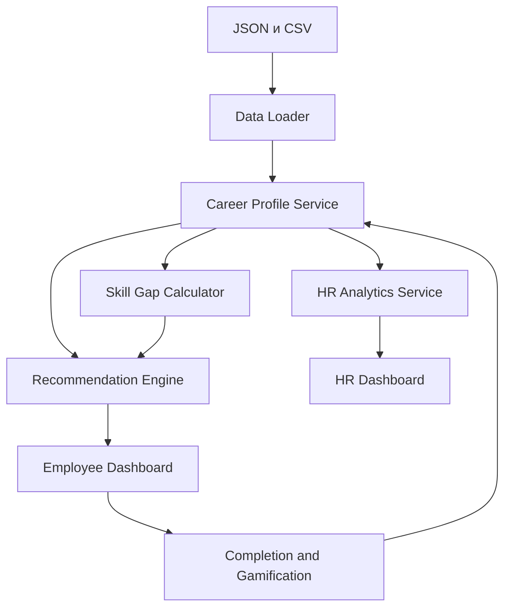

# Career Quest

> AI-навигатор карьерного развития, который превращает разрозненные HR-активности в понятную персональную траекторию роста сотрудника.

## О проекте

В крупных компаниях сотрудник регулярно получает уведомления о курсах, аттестациях, воркшопах, программах наставничества и внутренних мероприятиях. Обычно эти активности не объединены в единый маршрут: сотруднику трудно понять, что действительно приблизит его к желаемой роли, почему ему рекомендован конкретный курс и какой шаг следует выполнить первым.

**Career Quest** решает эту проблему. Система анализирует текущую роль и грейд сотрудника, его карьерную цель, уровень навыков и историю участия в мероприятиях. На основе этих данных она:

- рассчитывает готовность к целевой роли;
- определяет дефициты навыков (`skill gaps`);
- подбирает подходящие развивающие мероприятия;
- объясняет каждую рекомендацию понятными факторами;
- показывает следующий лучший шаг;
- визуализирует прогресс и поддерживает мотивацию с помощью элементов геймификации;
- предоставляет HR агрегированную аналитику по развитию сотрудников.

Целевая аудитория решения — сотрудники компании, HR-специалисты и руководители команд.

## Проблема и ценность решения

Без единой карьерной навигации сотрудник видит отдельные HR-события, но не видит связи между ними и своим профессиональным ростом. В результате снижается вовлечённость, обучение выбирается случайно, а HR сложно оценить общие дефициты компетенций.

Career Quest формирует последовательную логику:

```text
профиль сотрудника → карьерная цель → анализ навыков → рекомендации → действие → пересчёт прогресса
```

Решение отвечает сотруднику на три главных вопроса:

1. Насколько я готов к желаемой роли?
2. Каких навыков мне не хватает?
3. Что конкретно мне сделать дальше и почему?

## Что реализовано

### Кабинет сотрудника

- выбор сотрудника из загруженного набора данных;
- отображение отдела, роли, грейда, стажа, формата работы и карьерной цели;
- поддержка сотрудников как с заданной карьерной целью, так и без неё;
- определение следующего грейда внутри текущей роли, если цель не задана.

### Анализ карьерной готовности

- сопоставление текущих навыков с требованиями целевой роли и грейда;
- расчёт общего процента готовности;
- отдельное выделение достаточных, недостающих и критически важных навыков;
- учёт мероприятий, завершённых после последней оценки сотрудника и ещё не отражённых в его профиле навыков.

### Explainable AI Recommendation Engine

- фильтрация мероприятий по роли и грейду;
- проверка входных требований (`prerequisites`);
- исключение уже завершённых мероприятий;
- исключение обязательных HR-мероприятий из персональных рекомендаций;
- оценка влияния каждого мероприятия на существующий дефицит навыков;
- приоритизация критических навыков целевого профиля;
- учёт истории сотрудника: завершения, незавершённые активности, оценки и предпочтительный формат;
- формирование 1–3 персональных рекомендаций;
- понятное объяснение причин каждой рекомендации.

### Интерактивный прогресс

- завершение рекомендованной активности из интерфейса;
- применение прироста навыков с учётом ограничения `max_level`;
- автоматический пересчёт готовности к целевой роли;
- обновление следующего рекомендуемого шага;
- начисление XP и обновление уровня;
- отображение бейджей и прогресса.

### HR Dashboard

- средняя готовность сотрудников к карьерным целям;
- наиболее частые дефициты навыков;
- сотрудники без заданной карьерной цели;
- сотрудники без подходящего следующего шага;
- сводка статусов активностей: `completed`, `in_progress`, `dropped`, `no_show`, `declined`, `overdue`.

## Как работает решение

1. При запуске приложение загружает каталог навыков, профили ролей, сотрудников, мероприятия и историю активности.
2. Пользователь выбирает сотрудника.
3. Система определяет целевой профиль по `career_goal`. Если цель отсутствует, используется следующий грейд текущей роли.
4. Завершённые после `last_review_date` мероприятия применяются к расчётному профилю, поскольку их эффект ещё не отражён в исходных уровнях навыков.
5. Текущие уровни сравниваются с требованиями целевого профиля.
6. Recommendation Engine отбирает допустимые мероприятия и рассчитывает их полезность.
7. Интерфейс показывает процент готовности, дефициты и до трёх объяснимых рекомендаций.
8. После завершения мероприятия система обновляет навыки, XP, карьерный прогресс и следующий рекомендуемый шаг.
9. HR Dashboard агрегирует результаты по всей организации.

## Алгоритм расчёта прогресса

Для каждого навыка целевого профиля учитывается не больше требуемого уровня:

```text
careerProgress =
    Σ min(currentSkillLevel, requiredSkillLevel)
    ─────────────────────────────────────────── × 100%
              Σ requiredSkillLevel
```

Если навык отсутствует в профиле сотрудника, его текущий уровень считается равным `0`.

Дефицит навыка:

```text
skillGap = max(requiredSkillLevel - effectiveSkillLevel, 0)
```

Критические навыки дополнительно выделяются в интерфейсе и имеют повышенный вес при ранжировании рекомендаций.

## Алгоритм рекомендаций

Сначала система оставляет только те мероприятия, которые:

- не являются обязательными HR-активностями;
- соответствуют роли и грейду сотрудника;
- развивают хотя бы один недостающий навык;
- доступны с учётом текущих уровней навыков и `prerequisites`;
- ещё не были успешно завершены сотрудником (кроме повторяемого клуба `EV_036`).

Затем каждому мероприятию присваивается итоговый балл:

```text
recommendationScore =
    skillGapImpact × 4
  + criticalSkillImpact × 3
  + roleAndGradeMatch × 2
  + historyPreference
  - durationPenalty
  - dropoutRisk
```

Вместе с баллом система формирует объяснение минимум по трём факторам:

- какой дефицит навыка закрывает мероприятие;
- почему оно соответствует целевой роли и грейду;
- как при выборе учтена история сотрудника.

Пример объяснения:

> Рекомендуем **System Design Fundamentals**, потому что для перехода на следующий грейд сотруднику не хватает уровня System Design. Этот навык является критическим для целевого профиля. Мероприятие соответствует роли и грейду, а его входные требования уже выполнены.

Алгоритм является детерминированным и объяснимым: одинаковые входные данные дают одинаковый результат, а каждый фактор рекомендации можно проверить.

## Геймификация

Геймификация дополняет карьерную логику и помогает сотруднику видеть результат каждого действия:

- XP за завершённые активности;
- уровни развития;
- процент прохождения карьерного пути;
- бейджи за достижения;
- визуальное уведомление о полученной награде;
- выделение следующего шага.

XP и бейджи не заменяют профессиональную оценку: карьерная готовность рассчитывается только на основе навыков и требований целевой роли.

## Технологии

| Компонент | Технология |
|---|---|
| Backend | Java 17, Spring Boot, Spring MVC |
| Сборка | Maven |
| Интерфейс | Thymeleaf, HTML5, CSS3, JavaScript |
| Работа с JSON | Jackson |
| Работа с CSV | Apache Commons CSV |
| Источник данных | JSON и CSV-файлы заказчика |
| Рекомендации | Explainable rule-based recommendation engine |

Внешняя LLM и сторонние AI API в текущей версии не используются. Это позволяет запускать решение локально без API-ключей, обеспечивает воспроизводимость рекомендаций и не передаёт данные сотрудников внешним сервисам.

## Архитектура

Приложение построено как модульный Spring Boot-сервис.



Основные компоненты:

| Компонент | Ответственность |
|---|---|
| `Data Loader` | Загружает и валидирует входные JSON/CSV-данные |
| `Career Profile Service` | Определяет цель и формирует эффективный профиль навыков |
| `Skill Gap Calculator` | Рассчитывает прогресс и дефициты навыков |
| `Recommendation Engine` | Фильтрует, оценивает и объясняет рекомендации |
| `Gamification Service` | Рассчитывает XP, уровни и достижения |
| `HR Analytics Service` | Формирует агрегированные показатели |
| `Web Layer` | Отдаёт страницы и обрабатывает действия пользователя |

## Структура проекта

```text
career-quest/
├── pom.xml
├── README.md
└── src/
    └── main/
        ├── java/
        │   └── .../
        │       ├── controller/
        │       ├── model/
        │       ├── repository/
        │       └── service/
        └── resources/
            ├── data/
            │   ├── skills.json
            │   ├── employees.json
            │   ├── events.json
            │   └── activity_history.csv
            ├── static/
            │   ├── css/
            │   └── js/
            ├── templates/
            └── application.properties
```

## Данные

В проекте используется предоставленный заказчиком синтетический датасет. Все имена сотрудников и сведения о компаниях являются вымышленными.

**Дата среза:** `2026-10-01`  
**Период истории:** `2024-10-01` — `2026-09-30`

| Файл | Содержимое | Объём |
|---|---|---:|
| `skills.json` | Каталог навыков и требования к ролям по грейдам | 60 навыков, 8 ролей × 4 грейда |
| `employees.json` | Профили сотрудников | 200 сотрудников |
| `events.json` | Каталог развивающих мероприятий | 40 мероприятий |
| `activity_history.csv` | История участия в мероприятиях | 2 743 записи |

Поддерживаемые грейды: `Junior`, `Middle`, `Senior`, `Lead`. Уровни навыков задаются по шкале от `0` до `5`.

Решение не привязано к конкретным 200 сотрудникам: дополнительные профили сотрудников и записи истории в том же формате могут быть загружены без изменения алгоритма.

## Установка и запуск

### Требования

- JDK 17 или новее;
- Maven 3.9 или новее;
- свободный порт `8080`.

### Запуск

1. Клонируйте репозиторий и перейдите в каталог проекта:

```bash
git clone <repository-url>
cd career-quest
```

2. Убедитесь, что файлы датасета находятся в каталоге:

```text
src/main/resources/data/
```

3. Запустите приложение:

```bash
mvn spring-boot:run
```

Альтернативный запуск через собранный JAR:

```bash
mvn clean package
java -jar target/*.jar
```

4. Откройте в браузере:

```text
http://localhost:8080
```

Для локального запуска не требуются API-ключи или подключение к внешним сервисам.

## Как проверить решение

Жюри может повторить следующий сценарий:

1. Запустить приложение и открыть главную страницу.
2. Выбрать сотрудника `E0001 — Marat Yessenov`.
3. Проверить исходный профиль: `Backend Engineer`, грейд `Junior`, цель — `Backend Engineer Middle`.
4. Посмотреть рассчитанный процент готовности и список дефицитов навыков.
5. Открыть первую карточку рекомендации.
6. Проверить объяснение: недостающий навык, соответствие роли/грейду и фактор истории сотрудника.
7. Нажать кнопку завершения активности.
8. Убедиться, что уровень развиваемого навыка, XP и процент готовности обновились, а список рекомендаций был пересчитан.
9. Выбрать другого сотрудника и убедиться, что рекомендации изменились в соответствии с его профилем.
10. Перейти в `HR Dashboard` и проверить агрегированную аналитику.

Этот сценарий демонстрирует полный цикл:

```text
реальные входные данные → анализ skill gap → объяснимая рекомендация → действие → измеримый прогресс
```

## Ограничения текущей версии

- используется синтетический датасет, а не данные промышленной HR-системы;
- интеграция с корпоративными LMS, HRIS и календарями не реализована;
- авторизация и разграничение прав сотрудника, менеджера и HR не реализованы;
- рекомендации формируются объяснимым rule-based алгоритмом без LLM;
- весовые коэффициенты алгоритма заданы экспертно и пока не обучаются на обратной связи;
- завершение активности в демо-режиме моделируется внутри приложения;
- автоматическая оценка фактического повышения сотрудника не выполняется: система показывает готовность и рекомендации, но финальное решение остаётся за руководителем и HR.

## Возможности развития

- интеграция с корпоративной LMS и HRIS;
- авторизация и отдельные роли доступа;
- импорт новых данных через интерфейс;
- уведомления о ближайших мероприятиях;
- настройка весов Recommendation Engine по обратной связи;
- A/B-тестирование рекомендаций;
- мультиязычный интерфейс на казахском, русском и английском языках;
- LLM-слой для более естественного объяснения уже рассчитанных рекомендаций без передачи персональных данных.

## Развёрнутая версия

Публичная deployed-версия на момент подготовки README отсутствует. Решение запускается локально по инструкции выше.

## Ключевой результат

Career Quest не просто показывает сотруднику список курсов. Система связывает текущие навыки, карьерную цель и историю обучения в единую персональную траекторию, объясняет ценность каждого следующего шага и делает профессиональный рост измеримым и понятным.

